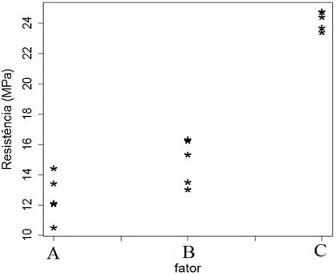

```{r setup, include=FALSE}
options(htmltools.dir.version = FALSE)
knitr::opts_chunk$set(echo = FALSE, 
                      comment = '',
                      message = FALSE,
                      warning = FALSE,
                      cache = TRUE)
```
<style> 
#caixa {
  border: 1px solid;
  padding: 10px;
  box-shadow: 5px 10px blue;
}
div {
  text-align: justify;
  text-justify: inter-word;
}
</style>

# Formação &#127891;

&#10004; Ensino básico

<br>

&#127979; EMEIF Álvares Machado

<br>

--

&#127979; EE Profa. Angélica de Oliveira

---

&#10004; Bacharel em Estatística

```{r , echo=FALSE, fig.align = 'center', out.width = '35%'}
knitr::include_graphics('figuras/fct.jpg')
```

<br>

--

&#10004; Mestrado e Doutorado em Ciências

```{r , echo=FALSE, fig.align = 'center', out.width = '45%'}
knitr::include_graphics('figuras/esalq.jpg')
```

---

# Universidades &#127979;

&#10004; Unoeste

```{r , echo=FALSE, fig.align = 'center', out.width = '25%'}
knitr::include_graphics('figuras/logo_unoeste.jpg')
```

<br>

&#10004; UEM

```{r , echo=FALSE, fig.align = 'center', out.width = '25%'}

```

<br>

&#10004; UTFPR

```{r , echo=FALSE, fig.align = 'center', out.width = '25%'}
knitr::include_graphics('figuras/utfpr.jpg')
```

---

# Apresentar-se

- Nome

<br>

- Período

<br>

- Porque escolheu o curso

```{r , echo=FALSE, fig.align = 'right', out.width = '60%'}
knitr::include_graphics('https://media.giphy.com/media/TKNGghpLhaz9XH1tSj/giphy.gif')
```

---

<!-- outra forma de inserir video

# Porque estudar Estatística &#128526;

```{r}
library(vembedr)

embed_url("https://www.youtube.com/watch?v=wV0Ks7aS7YI&t=27s") |> 
  use_rounded() |> 
  use_start_time(10) |> 
  use_align("center")
```

-->

# Importância da Estatística para Química &#129327;

&#10004; **Controle de qualidade**

<br>

--

&#10004; **Acompanhamento do Desempenho dos Alunos**

<br>

--

&#10004; **Estudar a viabilidade de novos produtos**

<br>

---

# Objetivo da disciplina &#127919;

<div id="caixa">
 <div>O objetivo é proporcionar aos alunos de graduação em Química uma introdução aos <font color="#0066cc">conceitos de estatística</font> utilizados na análise de dados, bem como o desenvolvimento da capacidade de <font color="#0066cc">interpretar os resultados</font> e estabelecer uma linguagem comum entre o químico e o estatístico.</div>
</div>

.pull-left[
Horário da Aula &#9200;
]
.pull-right[
- Terça-feira das 21:20--23:00

- Quarta-feira das 18:40--20:20

- **Tolerância**: 10 minutos
]

<br>

--

.pull-left[
Horário de Atendimento &#9200;
]
.pull-right[
- Segunda-feira das 10:20-11:10

- Terça-feira das 19:30-20:50
]

---

# Conteúdo Programático &#128214;

&#10004; Conceitos básicos de probabilidade

```{r , echo=FALSE, fig.align = 'center', out.width = '40%'}
knitr::include_graphics('figuras/fig2.jpg')
```

<br>

--

&#10004; Conceitos básicos Variável aleatória e modelos de distribuição de probabilidade.

```{r , echo=FALSE, fig.align = 'center', out.width = '50%'}
knitr::include_graphics('figuras/fig4.jpg')
```

<br>

---

&#10004; Conceitos básicos de inferência estatística.

```{r , echo=FALSE, fig.align = 'center', out.width = '50%'}
knitr::include_graphics('figuras/fig5.jpg')
```

<br>

--

&#10004; Conceitos básicos de estatística experimental.

```{r , echo=FALSE, fig.align = 'center', out.width = '50%'}

```

---

# Bibliografia básica &#128218;

&#10004; BUSSAB, Wilton de Oliveira; MORETTIN, Pedro Alberto. **Estatística básica**. 5ed. São Paulo: Saraiva, 2004. 526 p.

```{r , echo=FALSE, fig.align = 'center', out.width = '35%'}
knitr::include_graphics('figuras/fig8.jpg')
```

---

# Bibliografia básica &#128218;

&#10004; MONTGOMERY, Douglas C.; RUNGER, George C. **Estatística aplicada e probabilidade para engenheiros**. 4ed. Rio de Janeiro, RJ: LTC, 2009, 493 p.

```{r , echo=FALSE, fig.align = 'center', out.width = '35%'}
knitr::include_graphics('figuras/fig9.jpg')
```

---

# Bibliografia complementar &#128218;

- MORETTIN, L.G. **Estatística básica: probabilidade e inferência**, volume único. São Paulo: Pearson Prentice Hall, 2009. 375 p.

<br>

- SPIEGEL, M.R.; SCHILLER, J.J.; SRINIVASAN, R.A. **Teoria e problemas de probabilidade e estatística**. 2.ed. São Paulo: McGraw-Hill, 2004. 398 p.

<br>

- FONSECA, J.S.; MARTINS, G.A. **Curso de estatística**. 6.ed. São Paulo: Atlas, 1996. 320 p. 

---

# 

&#10004; <https://moodle.utfpr.edu.br/login/index.php>

<br>

&#10004; Londrina - Graduação - Química - 4o período

<br>

&#10004; Disciplina: 2025 - S2 - Probabilidade e Estatística

<br>

.pull-left[
&#10004; Senha: MA85A
]
.pull-right[
```{r , echo=FALSE, fig.align = 'left', out.width = '80%'}
knitr::include_graphics('https://media.giphy.com/media/IoP0PvbbSWGAM/giphy.gif')
```
]

<br>